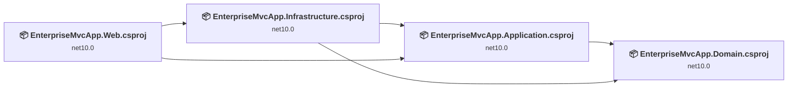
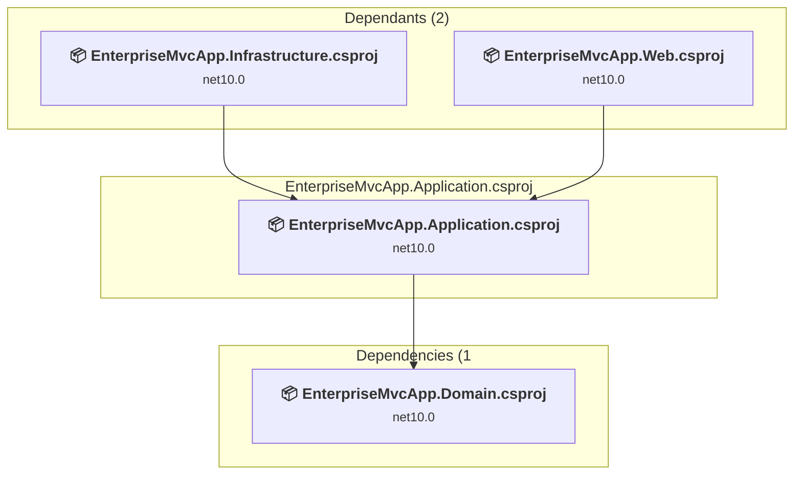
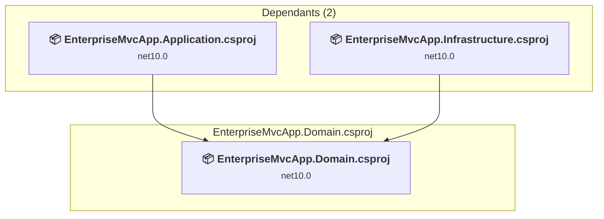
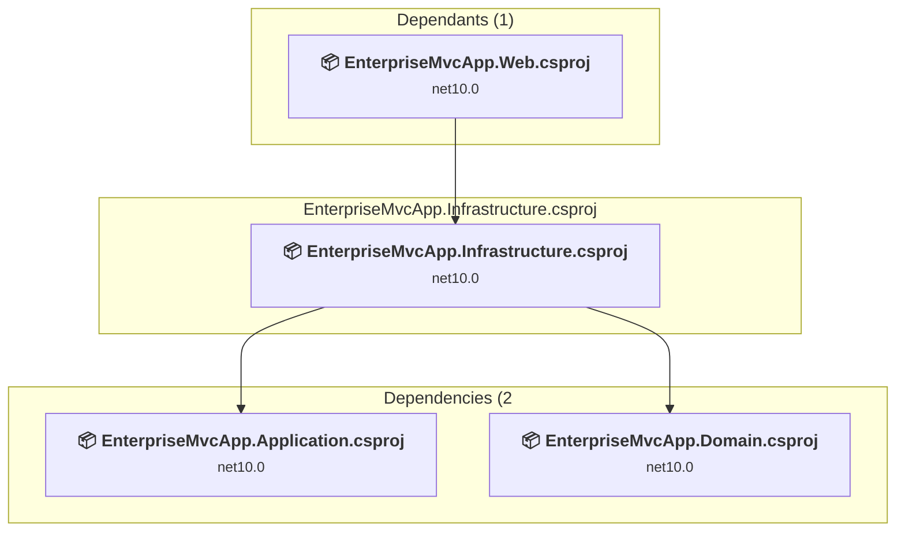
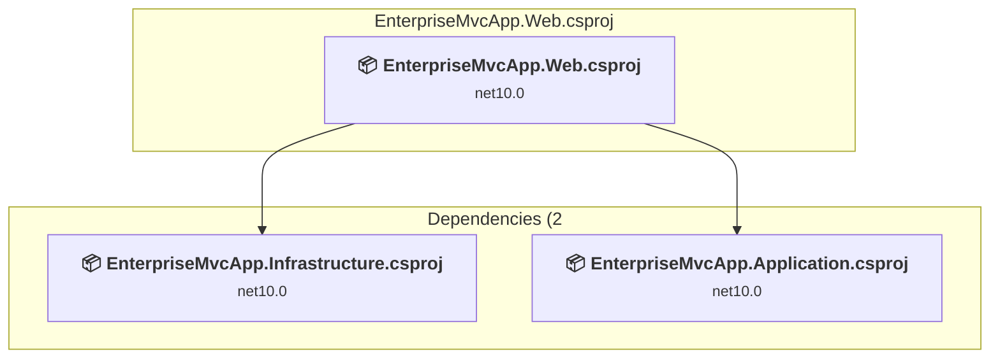

# Projects and dependencies analysis

This document provides a comprehensive overview of the projects and their dependencies in the context of upgrading to .NETCoreApp,Version=v8.0.

## Table of Contents

- [Executive Summary](#executive-Summary)
  - [Highlevel Metrics](#highlevel-metrics)
  - [Projects Compatibility](#projects-compatibility)
  - [Package Compatibility](#package-compatibility)
  - [API Compatibility](#api-compatibility)
- [Aggregate NuGet packages details](#aggregate-nuget-packages-details)
- [Top API Migration Challenges](#top-api-migration-challenges)
  - [Technologies and Features](#technologies-and-features)
  - [Most Frequent API Issues](#most-frequent-api-issues)
- [Projects Relationship Graph](#projects-relationship-graph)
- [Project Details](#project-details)

  - [EnterpriseMvcApp.Application\EnterpriseMvcApp.Application.csproj](#enterprisemvcappapplicationenterprisemvcappapplicationcsproj)
  - [EnterpriseMvcApp.Domain\EnterpriseMvcApp.Domain.csproj](#enterprisemvcappdomainenterprisemvcappdomaincsproj)
  - [EnterpriseMvcApp.Infrastructure\EnterpriseMvcApp.Infrastructure.csproj](#enterprisemvcappinfrastructureenterprisemvcappinfrastructurecsproj)
  - [EnterpriseMvcApp.Web\EnterpriseMvcApp.Web.csproj](#enterprisemvcappwebenterprisemvcappwebcsproj)

## Executive Summary

### Highlevel Metrics

| Metric | Count | Status |
| :--- | :---: | :--- |
| Total Projects | 4 | 0 require upgrade |
| Total NuGet Packages | 9 | All compatible |
| Total Code Files | 17 |  |
| Total Code Files with Incidents | 0 |  |
| Total Lines of Code | 240 |  |
| Total Number of Issues | 0 |  |
| Estimated LOC to modify | 0+ | at least 0,0% of codebase |

### Projects Compatibility

| Project | Target Framework | Difficulty | Package Issues | API Issues | Est. LOC Impact | Description |
| :--- | :---: | :---: | :---: | :---: | :---: | :--- |
| [EnterpriseMvcApp.Application\EnterpriseMvcApp.Application.csproj](#enterprisemvcappapplicationenterprisemvcappapplicationcsproj) | net10.0 | ✅ None | 0 | 0 |  | ClassLibrary, Sdk Style = True |
| [EnterpriseMvcApp.Domain\EnterpriseMvcApp.Domain.csproj](#enterprisemvcappdomainenterprisemvcappdomaincsproj) | net10.0 | ✅ None | 0 | 0 |  | ClassLibrary, Sdk Style = True |
| [EnterpriseMvcApp.Infrastructure\EnterpriseMvcApp.Infrastructure.csproj](#enterprisemvcappinfrastructureenterprisemvcappinfrastructurecsproj) | net10.0 | ✅ None | 0 | 0 |  | ClassLibrary, Sdk Style = True |
| [EnterpriseMvcApp.Web\EnterpriseMvcApp.Web.csproj](#enterprisemvcappwebenterprisemvcappwebcsproj) | net10.0 | ✅ None | 0 | 0 |  | AspNetCore, Sdk Style = True |

### Package Compatibility

| Status | Count | Percentage |
| :--- | :---: | :---: |
| ✅ Compatible | 9 | 100,0% |
| ⚠️ Incompatible | 0 | 0,0% |
| 🔄 Upgrade Recommended | 0 | 0,0% |
| ***Total NuGet Packages*** | ***9*** | ***100%*** |

### API Compatibility

| Category | Count | Impact |
| :--- | :---: | :--- |
| 🔴 Binary Incompatible | 0 | High - Require code changes |
| 🟡 Source Incompatible | 0 | Medium - Needs re-compilation and potential conflicting API error fixing |
| 🔵 Behavioral change | 0 | Low - Behavioral changes that may require testing at runtime |
| ✅ Compatible | 0 |  |
| ***Total APIs Analyzed*** | ***0*** |  |

## Aggregate NuGet packages details

| Package | Current Version | Suggested Version | Projects | Description |
| :--- | :---: | :---: | :--- | :--- |
| AutoMapper | 16.1.1 |  | [EnterpriseMvcApp.Application.csproj](#enterprisemvcappapplicationenterprisemvcappapplicationcsproj) | ✅Compatible |
| AutoMapper.Extensions.Microsoft.DependencyInjection | 12.0.1 |  | [EnterpriseMvcApp.Application.csproj](#enterprisemvcappapplicationenterprisemvcappapplicationcsproj) | ✅Compatible |
| FluentValidation | 12.1.1 |  | [EnterpriseMvcApp.Application.csproj](#enterprisemvcappapplicationenterprisemvcappapplicationcsproj) | ✅Compatible |
| FluentValidation.DependencyInjectionExtensions | 12.1.1 |  | [EnterpriseMvcApp.Application.csproj](#enterprisemvcappapplicationenterprisemvcappapplicationcsproj) | ✅Compatible |
| MediatR | 14.1.0 |  | [EnterpriseMvcApp.Application.csproj](#enterprisemvcappapplicationenterprisemvcappapplicationcsproj) | ✅Compatible |
| MediatR.Extensions.Microsoft.DependencyInjection | 11.1.0 |  | [EnterpriseMvcApp.Application.csproj](#enterprisemvcappapplicationenterprisemvcappapplicationcsproj) | ✅Compatible |
| Microsoft.EntityFrameworkCore | 10.0.5 |  | [EnterpriseMvcApp.Infrastructure.csproj](#enterprisemvcappinfrastructureenterprisemvcappinfrastructurecsproj) | ✅Compatible |
| Microsoft.EntityFrameworkCore.SqlServer | 10.0.5 |  | [EnterpriseMvcApp.Infrastructure.csproj](#enterprisemvcappinfrastructureenterprisemvcappinfrastructurecsproj) | ✅Compatible |
| Microsoft.EntityFrameworkCore.Tools | 10.0.5 |  | [EnterpriseMvcApp.Infrastructure.csproj](#enterprisemvcappinfrastructureenterprisemvcappinfrastructurecsproj) | ✅Compatible |

## Top API Migration Challenges

### Technologies and Features

| Technology | Issues | Percentage | Migration Path |
| :--- | :---: | :---: | :--- |

### Most Frequent API Issues

| API | Count | Percentage | Category |
| :--- | :---: | :---: | :--- |

## Projects Relationship Graph

Legend:
📦 SDK-style project
⚙️ Classic project

## Project Details

### EnterpriseMvcApp.Application\EnterpriseMvcApp.Application.csproj

#### Project Info

- **Current Target Framework:** net10.0✅
- **SDK-style**: True
- **Project Kind:** ClassLibrary
- **Dependencies**: 1
- **Dependants**: 2
- **Number of Files**: 1
- **Lines of Code**: 6
- **Estimated LOC to modify**: 0+ (at least 0,0% of the project)

#### Dependency Graph

Legend:
📦 SDK-style project
⚙️ Classic project

### API Compatibility

| Category | Count | Impact |
| :--- | :---: | :--- |
| 🔴 Binary Incompatible | 0 | High - Require code changes |
| 🟡 Source Incompatible | 0 | Medium - Needs re-compilation and potential conflicting API error fixing |
| 🔵 Behavioral change | 0 | Low - Behavioral changes that may require testing at runtime |
| ✅ Compatible | 0 |  |
| ***Total APIs Analyzed*** | ***0*** |  |

### EnterpriseMvcApp.Domain\EnterpriseMvcApp.Domain.csproj

#### Project Info

- **Current Target Framework:** net10.0✅
- **SDK-style**: True
- **Project Kind:** ClassLibrary
- **Dependencies**: 0
- **Dependants**: 2
- **Number of Files**: 1
- **Lines of Code**: 6
- **Estimated LOC to modify**: 0+ (at least 0,0% of the project)

#### Dependency Graph

Legend:
📦 SDK-style project
⚙️ Classic project

### API Compatibility

| Category | Count | Impact |
| :--- | :---: | :--- |
| 🔴 Binary Incompatible | 0 | High - Require code changes |
| 🟡 Source Incompatible | 0 | Medium - Needs re-compilation and potential conflicting API error fixing |
| 🔵 Behavioral change | 0 | Low - Behavioral changes that may require testing at runtime |
| ✅ Compatible | 0 |  |
| ***Total APIs Analyzed*** | ***0*** |  |

### EnterpriseMvcApp.Infrastructure\EnterpriseMvcApp.Infrastructure.csproj

#### Project Info

- **Current Target Framework:** net10.0✅
- **SDK-style**: True
- **Project Kind:** ClassLibrary
- **Dependencies**: 2
- **Dependants**: 1
- **Number of Files**: 1
- **Lines of Code**: 6
- **Estimated LOC to modify**: 0+ (at least 0,0% of the project)

#### Dependency Graph

Legend:
📦 SDK-style project
⚙️ Classic project

### API Compatibility

| Category | Count | Impact |
| :--- | :---: | :--- |
| 🔴 Binary Incompatible | 0 | High - Require code changes |
| 🟡 Source Incompatible | 0 | Medium - Needs re-compilation and potential conflicting API error fixing |
| 🔵 Behavioral change | 0 | Low - Behavioral changes that may require testing at runtime |
| ✅ Compatible | 0 |  |
| ***Total APIs Analyzed*** | ***0*** |  |

### EnterpriseMvcApp.Web\EnterpriseMvcApp.Web.csproj

#### Project Info

- **Current Target Framework:** net10.0✅
- **SDK-style**: True
- **Project Kind:** AspNetCore
- **Dependencies**: 2
- **Dependants**: 0
- **Number of Files**: 20
- **Lines of Code**: 222
- **Estimated LOC to modify**: 0+ (at least 0,0% of the project)

#### Dependency Graph

Legend:
📦 SDK-style project
⚙️ Classic project

### API Compatibility

| Category | Count | Impact |
| :--- | :---: | :--- |
| 🔴 Binary Incompatible | 0 | High - Require code changes |
| 🟡 Source Incompatible | 0 | Medium - Needs re-compilation and potential conflicting API error fixing |
| 🔵 Behavioral change | 0 | Low - Behavioral changes that may require testing at runtime |
| ✅ Compatible | 0 |  |
| ***Total APIs Analyzed*** | ***0*** |  |

